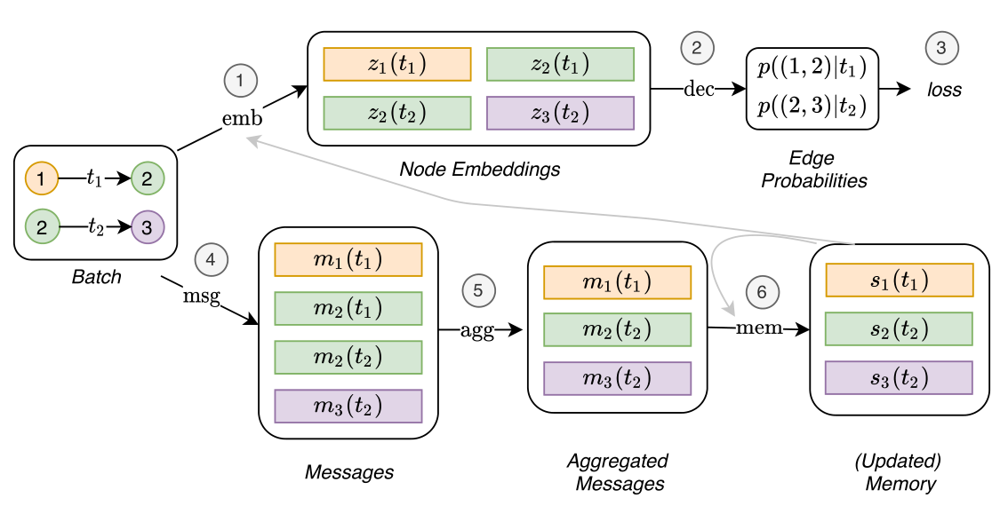

## Message computation

{width=65%}

$$
\mathbf{m}_i(t) = \mathrm{msg}\left(\mathbf{s}_i(t^-), \mathbf{s}_j(t^-), \Delta t, \mathbf{e}_{ij}(t)\right)
$$

## Message aggregator

{width=65%}

Combine all messages in a single batch for a specific node:
$$
\bar{\mathbf{m}}_i(t) = \mathrm{agg}\left(\mathbf{m}_i(t_1), \hdots, \mathbf{m}_i(t_b)\right)
$$

## Memory update

{width=65%}

Using a Recurrent Neural Network:
$$
\mathbf{s}_i(t) = \mathrm{mem}\left(\bar{\mathbf{m}}_i(t), \mathbf{s}_i(t^-)\right)
$$

## Embedding computation

{width=65%}

$$
\mathbf{z}_i(t) = \mathrm{emb}(i, t) = \sum_{j \in \mathcal{N}^k_i([0, t]) } h\left(\mathbf{s}_i(t), \mathbf{s}_j(t), \mathbf{e}_{ij}, \mathbf{v}_i(t), \mathbf{v}_j(t)\right), \nonumber
$$

Includes specific cases like: memory directly, time projection (JODIE), Temporal Graph Attention (TGAT), Temporal Graph Sum

## TGN training

![TGN training [^2]](tgn_train.png){width=65%}

Problem: memory-related modules (Message function, Message aggregator, and Memory updater) do not directly influence the loss and therefore do not receive a gradient -> memory update before predictions

[^2]: Figure taken from "Temporal Graph Networks For Deep Learning on Dynamic Graphs, _Rossi et al._"
