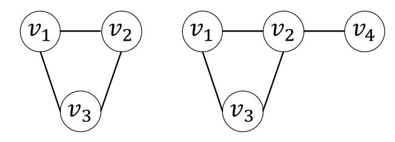
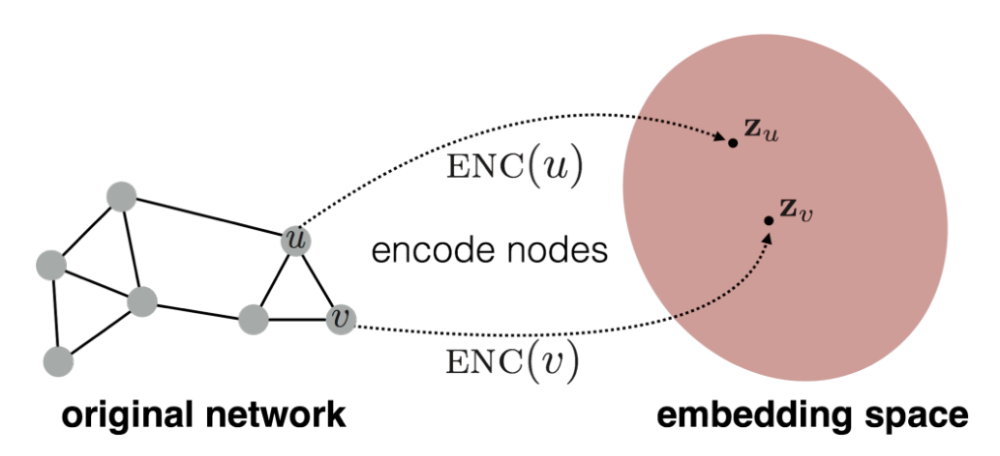
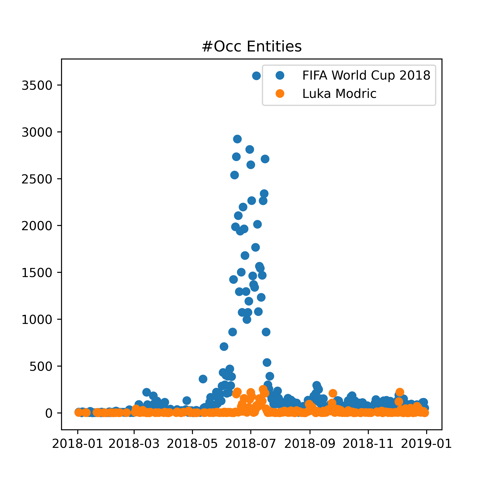

## Outline

\tableofcontents

# Graph Representation Learning

## Short Primer On Graph RL

> Project nodes into a latent vector space where geometric relations correspond to relationships in the original graph.

![The node embedding problem[^10].](images/graph_rl_schema.png){width=65%}

[^10]: Graph Representation Learning, _Hamilton 2020_.

## An Encoder-Decoder Perspective

![Overview of the encoder-decoder perspective[^11].](images/encoder_decoder_schema.png){width=65%}

\pause
$$
\textrm{DEC}\left(\textrm{ENC}(u), \textrm{ENC}(v)\right) = \textrm{DEC}\left(\mathbf{z}_u, \mathbf{z}_v\right) \approx \mathbf{S}[u,v]
$$

\pause

$$
\mathcal{L} = \sum_{(u,v) \in \mathcal{D}} \ell \left(\textrm{DEC}(\mathbf{z}_u, \mathbf{z}_v), \mathbf{S}[u,v]\right)
$$

[^11]: Graph Representation Learning, _Hamilton 2020_.


## Dynamic Graph Representation Learning {.t}

\vspace{1cm}

::: columns

:::: column

*Discrete-Time Dynamic Graphs*
\linebreak

{width=80%}

::::

:::: column

*Continuous-Time Dynamic Graphs*
\linebreak

Timed list of events, including node addition, deletion and edge addition and deletion.
\linebreak
```
{
    AddNode(v_4, t_1),
    AddEdge((v_2, v_4), t_2),
    AddEdge((v_2, v_3), t_3),
    ...
}

```

::::

:::


## Example: Temporal Graph Networks[^1]

{width=65%}


[^1]: "Temporal Graph Networks For Deep Learning on Dynamic Graphs, _Rossi et al._"

## Example: TGN for future link prediction

::: columns

:::: column

`{`{=latex}\centering {width=80%} \par`}`{=latex}

::::

:::: column

Dataset:

- Wikipedia with bipartite interaction graphs (users and pages as nodes)
- interaction events carry text features (edits) and chronological split

\vspace{1cm}

Decoder:

- predict future edits -> concatenate two node embeddings into simple MLP

::::

:::

## Example: TGN encoder


![TGN computations on a single batch of time-stamped interactions[^2].](tgn_computations.png){width=65%}

Core idea: combining memory module with graph-based operators


[^2]: Figure taken from "Temporal Graph Networks For Deep Learning on Dynamic Graphs, _Rossi et al._"


# GDELT Dataset

## The GDELT Project...

> "... monitors the world's broadcast, print, and web news."

![Person co-occurrence in articles covering Syria and Turkey.[^18]](images/gdelt_example.png){width=50%}


[^18]: \url{https://medium.com/@atakanguney94/a-brief-introduction-into-gdelt-gtc64d03a}

## The Global Entity Graph

Random sample of news articles every 15 minutes (roughly 100k per day)

Google NLP API extracts entities from each article

```json
{
  "url": "https://chicago.suntimes.com/news/washington-state-ends-racially-biased-death-penalty/",
  "lang": "en",
  "date": "2018-10-12T00:15:00Z",
  "score": -0.2,
  "magnitude": 12.3,
  "entities": [
    {
      "name": "Supreme Court",
      "type": "ORGANIZATION",
      "numMentions": 1,
      "avgSalience": 0.04405
    },
    ...
}
```

## Creating a Graph

Each pair of entities occurring in a single article correspond to an edge event with timestamp:

```
Nathan Trott	    RB Leipzig
Manchester United	RB Leipzig
West Ham	        RB Leipzig
Timo Werner	        RB Leipzig
Ralf Rangnick	    RB Leipzig
Bundesliga	        RB Leipzig
Patrick Dempsey	    Leipzig
Leipzig	            Germany
Patrick Dempsey	    Leipzig
Leipzig	            Germany
Patrick Dempsey	    Leipzig
Leipzig	            Germany
...
```

Restricting to the 4 most salient entities gives roughly 200k edges per day.


## Data Example: IPCC

::: columns

:::: column

::::

:::: column


```
         entity_1   entity_2  count
             IPCC      India     18
Michael McCormack       IPCC     15
   Scott Morrison       IPCC     15
            India       IPCC     15
     Donald Trump       IPCC     15
    United States       IPCC     14
   European Union       IPCC     14
      Hoesung Lee       IPCC     14
ottish Government       IPCC     12
             IPCC         US     12
```
::::

:::

# Research Idea: Activity Prediction

## Motivation

### How can we identify entities with similar temporal dynamics, e.g. "hot" topics?

## The Embedding Space

::: columns

:::: column

Standard setting: \linebreak

{width=100%}

::::

:::: column

Proposed approach: \linebreak

{width=100%}

::::

:::


## Deep Learning Architecture


Replace decoder with a RNN which predicts the future #Occurrences per day for a given entity and time horizon

## Why is the graph information relevant?

::: columns

:::: column


::::

:::: column



::::

:::

### The neighborhood should be strong indicator for future behavior.


## Current Status

Dataset preparation:

- implemented data fetching, processing and interim representation
- large dataset -> setup streaming scenario

\pause

Running baseline experiments:

- time series prediction for number of occurrences (no neighborhood info)

## Open Questions and Challenges

Limitations:

- cannot predict one time events

\pause

Open questions:

- Can we split relative and absolute dynamics?
- What should be the prediction horizon?


## Conclusion

`{`{=latex}\centering {width=65%} \par`}`{=latex}

\vspace{1cm}

\pause

### Thank you! Questions?

