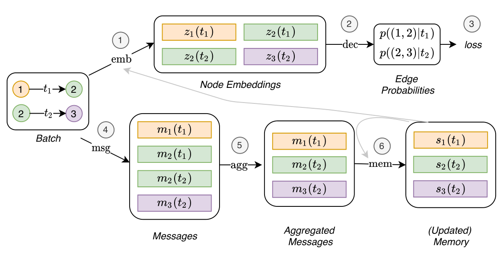
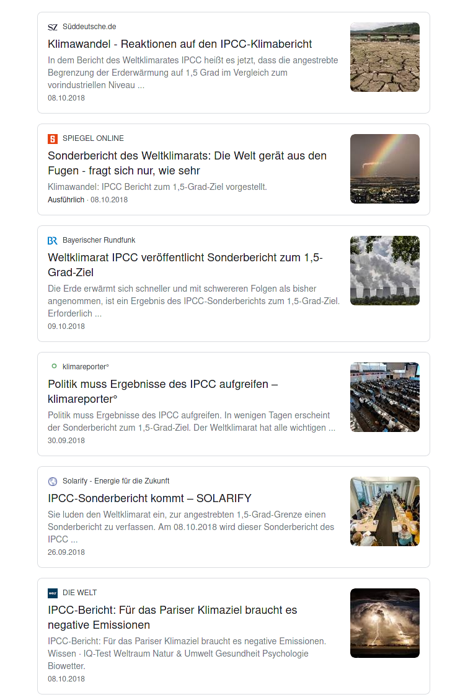
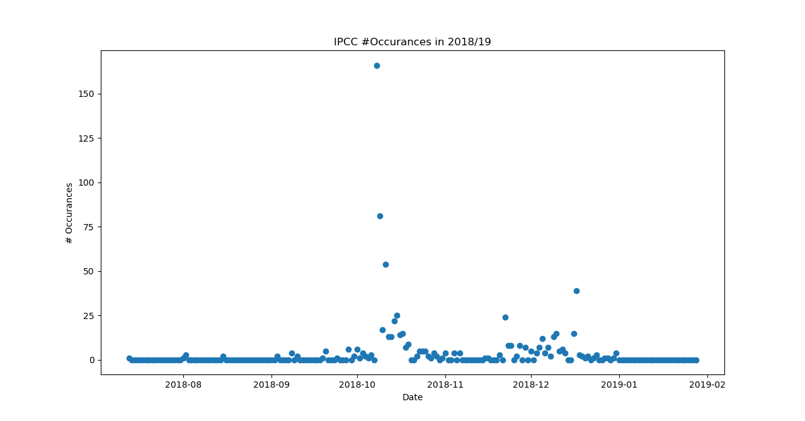
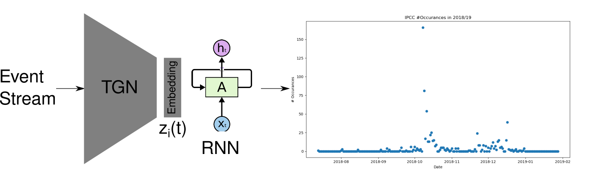

## Outline

\tableofcontents

# Dynamic Graph Representation Learning


## Dynamic Graph Representation Learning

### Discrete-time dynamic graphs (DTDG)

Sequences of static graph snapshots.

### Continuous-time dynamic graphs (CTDG)

Timed list of events, including node addition, deletion and edge addition and deletion.

## Temporal Graph Networks (TGN)

{width=65%}

Current decoders:

- future edge (‘link’) prediction
- dynamic node classification

Problem settings:

- Transductive: only nodes which have been used in training
- Inductive: additionally nodes which have *not* been used in training

## Example: TGN for future link prediction[^1]

Datasets:

- Reddit, Wikipedia: Bipartite interaction graphs with users and subreddits/pages as nodes.
- Twitter: Users are nodes and retweets are interactions.

All interaction events carry text features (tweets, edits, posts) and 70%-15%-15% (train-valid-test) chronological split is used.

Exemplary decoder: simple MLP decoder mapping from the concatenation of two node embeddings to the probability of the edge

[^1]: "Temporal Graph Networks For Deep Learning on Dynamic Graphs, _Rossi et al._"

## Example: TGN encoder


![TGN computations on a single batch of time-stamped interactions[^2].](tgn_computations.png){width=65%}

Core idea: combining memory module with graph-based operators


[^2]: Figure taken from "Temporal Graph Networks For Deep Learning on Dynamic Graphs, _Rossi et al._"


## Message computation

{width=65%}

$$
\mathbf{m}_i(t) = \mathrm{msg}\left(\mathbf{s}_i(t^-), \mathbf{s}_j(t^-), \Delta t, \mathbf{e}_{ij}(t)\right)
$$

## Message aggregator

{width=65%}

Combine all messages in a single batch for a specific node:
$$
\bar{\mathbf{m}}_i(t) = \mathrm{agg}\left(\mathbf{m}_i(t_1), \hdots, \mathbf{m}_i(t_b)\right)
$$

## Memory update

{width=65%}

Using a Recurrent Neural Network:
$$
\mathbf{s}_i(t) = \mathrm{mem}\left(\bar{\mathbf{m}}_i(t), \mathbf{s}_i(t^-)\right)
$$

## Embedding computation

{width=65%}

$$
\mathbf{z}_i(t) = \mathrm{emb}(i, t) = \sum_{j \in \mathcal{N}^k_i([0, t]) } h\left(\mathbf{s}_i(t), \mathbf{s}_j(t), \mathbf{e}_{ij}, \mathbf{v}_i(t), \mathbf{v}_j(t)\right), \nonumber
$$

Includes specific cases like: memory directly, time projection (JODIE), Temporal Graph Attention (TGAT), Temporal Graph Sum

## TGN training

![TGN training [^2]](tgn_train.png){width=65%}

Problem: memory-related modules (Message function, Message aggregator, and Memory updater) do not directly influence the loss and therefore do not receive a gradient -> memory update before predictions

[^2]: Figure taken from "Temporal Graph Networks For Deep Learning on Dynamic Graphs, _Rossi et al._"


# GDELT Dataset

## The GDELT Dataset

> "The GDELT Project monitors the world's broadcast, print, and web news from nearly every corner of every country in over 100 languages and identifies the people, locations, organizations, themes, sources, emotions, counts, quotes, images and events driving our global society every second of every day, creating a free open platform for computing on the entire world."

- Global Knowledge Graph
- Global Event Database
- Global Entity Graph
- Global Frontpage Graph


## The Global Entity Graph

Random sample of news articles every 15 minutes (roughly 100k per day)

Google NLP API extracts entities from each article

```json
{
  "url": "https://chicago.suntimes.com/news/washington-state-ends-racially-biased-death-penalty/",
  "lang": "en",
  "date": "2018-10-12T00:15:00Z",
  "score": -0.2,
  "magnitude": 12.3,
  "entities": [
    {
      "name": "Supreme Court",
      "type": "ORGANIZATION",
      "numMentions": 1,
      "avgSalience": 0.04405
    },
    ...
}
```

## Creating a Graph

Each pair of entities occurring in a single article correspond to an edge event with timestamp:

```
Nathan Trott	    RB Leipzig
Manchester United	RB Leipzig
West Ham	        RB Leipzig
Timo Werner	        RB Leipzig
Ralf Rangnick	    RB Leipzig
Bundesliga	        RB Leipzig
Patrick Dempsey	    Leipzig
Leipzig	            Germany
Patrick Dempsey	    Leipzig
Leipzig	            Germany
Patrick Dempsey	    Leipzig
Leipzig	            Germany
...
```

Restricting to the 4 most salient entities gives roughly 200k edges per day


## Data Example: IPCC

::: columns

:::: column

::::

:::: column


```
         entity_1   entity_2  count
             IPCC      India     18
Michael McCormack       IPCC     15
   Scott Morrison       IPCC     15
            India       IPCC     15
     Donald Trump       IPCC     15
    United States       IPCC     14
   European Union       IPCC     14
      Hoesung Lee       IPCC     14
ottish Government       IPCC     12
             IPCC         US     12
```
::::

:::

# Research Idea

## Motivation

### How can we identify entities with similar temporal dynamics, e.g. "hot" topics?

## Approach



Replace decoder with a RNN which predicts the future #Occurrences per day for a given entity and time horizon

## Approach

::: columns

:::: column

*Why is the graph information relevant?*

------------------------------------

The neighborhood should be strong indicator for future behavior: If all my neighbors are getting popular, then it is very likely that I will too.

::::

:::: column


::::

:::

## The Embedding Space

- before (link prediction): similarity predicts future link between two entities
- now (activity prediction): embedding space represents temporal dynamics
    - clustering
    - split relative and absolute dynamics
    - duplicate detection

## Details

- Current state:
    - preparing dataset 
- Baseline: time series prediction for number of occurrences (no neighborhood info)
- Open questions:
    - What is a single data point?
    - How to batch the data?
